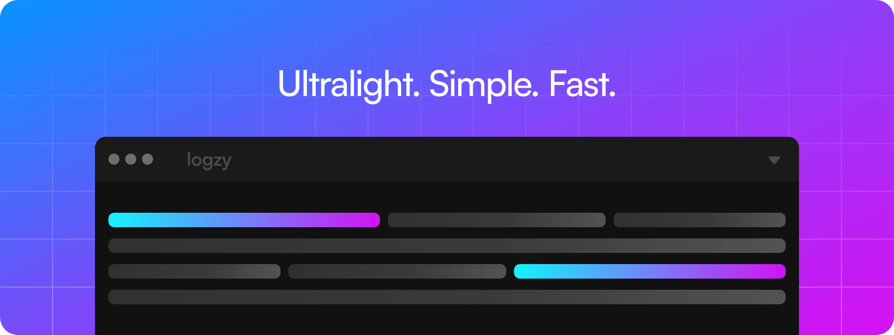

<p align="center">
  
</p>

<h1 align="center">logzy</h1>
<p align="center">Ultralight and simple stylizer for console logs.</p>

## Features

- **Zero dependencies!**
- Ultralight! Less than **1kb**
- Flexible and user friendly API
- Supports Object debugging
- Provides utils for advanced nesting
- Adds life to the console.log
- Ridiculously easy to use
- Really fast

## Installation

```sh
npm i -D logzy
```

## API

### log()

Custom function for stylizing console messages.

```js
/**
 * @function
 * @param {String} keys - Accepts one or more values separated by a space.
 * @param {*} message - Custom message. Can be anything.
 * @param {String} debug - Enables debug mode for objects. Can be 'inspect' or 'json'.
 * @return {String} - Returns a styled message, e.g. console.log(styledMessage)
 */
log(keys, message, debug)
```

```js
// Examples

import { log } from 'logzy'

// Outputs a stylized message
log('cyan', 'custom message...')
log('lime bold underline', 33 * 77)
log('black bold bg_white', message)

// Outputs a stylized console object
log('cyan italic', console, 'inspect')

// Outputs a stylized object in JSON format
log('sky italic bold', { a: 'b', c: 'd', e: 'f' }, 'json')

// Outputs an unstylized message if only one param is specified
log('logzy...')

// Outputs a new line break if no params are specified
log()
```

### Nesting & Customization

Logzy comes with a built-in tiny utilities designed for nesting and raw customization.

```js
// Outputs a stylized message, e.g. `\x1b[96m\x1b[1m${message}\x1b[0m`
log.$(keys, message, debug)

// Outputs a single raw value, e.g. `\x1b[96m`
log.key
```

These utils must be wrapped with `console.log` to actually output the styled message.

```js
import { log } from 'logzy'

// this is the same
console.log(`${log.cyan}${log.bold}logzy is fire 🔥${log.reset}`)

// as this
console.log(log.$('cyan bold', 'logzy is fire 🔥'))
```

```js
// Examples

import { log } from 'logzy'

const { $, bold, cyan, reset } = log

console.log($('cyan bold underline', 'logzy is fire'))

console.log(`${$('lime bold', 'logzy')} is ${$('rose italic', 'fire')}`)

console.log(`${bold}${cyan}custom message...${reset}`)
```

### Debugging

Also, Logzy supports object outputs with a node's `inspect` utility and native `JSON.stringify` method under the hood.

By default, `debug` mode is disabled.

```js
// Examples

import { log } from 'logzy'

// enables node's inspect utility
log('cyan italic', console, 'inspect')

const obj = {
  a: 'logzy',
  b: {
    c: {
      d: [1, 2, 3]
    },
    e: {
      f: true
    }
  }
}

// enables JSON.stringify method
log('lime bold', obj, 'json')
```

## Keys

List of all available `keys`

| Text Colors | Background Colors | Text Styles |
| ----------- | ----------------- | ----------- |
| amber       | bg_amber          | bold        |
| black       | bg_black          | crossout    |
| blue        | bg_blue           | darken      |
| cyan        | bg_cyan           | hidden      |
| gray        | bg_gray           | invert      |
| green       | bg_green          | italic      |
| indigo      | bg_indigo         | reset       |
| lime        | bg_lime           | underline   |
| magenta     | bg_magenta        |             |
| pink        | bg_pink           |             |
| red         | bg_red            |             |
| rose        | bg_rose           |             |
| silver      | bg_silver         |             |
| sky         | bg_sky            |             |
| white       | bg_white          |             |
| yellow      | bg_yellow         |             |

## Show Support

This is a free and open source project available to everyone. If you like it, `leave a star` to show your support.

### Starring a repository

Navigate to the top-right corner of the page and click the <kbd>☆ Star</kbd> button.

## License

### logzy

[MIT License](LICENSE)

Copyright © Ivo Dolenc

Developed in Croatia 🇭🇷
